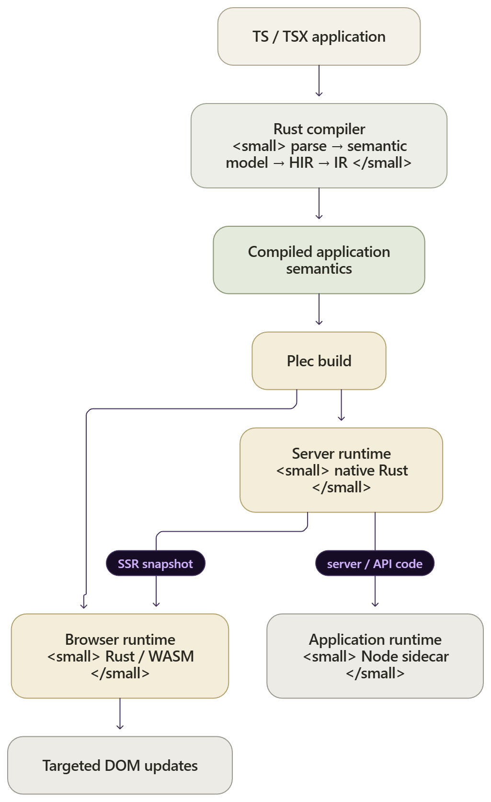

<p align="center">
  
</p>

# Plec

> **Experimental.** Plec is an early-stage framework exploring a compiled semantic application model. It is not yet intended for production use.

Plec is a full-stack framework for building data-intensive web applications around a **compiled semantic application graph**.

Most web frameworks ultimately compile application source into application-specific JavaScript that owns rendering, reconciliation, routing, and application behavior.

Plec takes a different approach.

Application semantics (UI structure, state, dependencies, actions, routing, loaders, and capabilities) are compiled into a portable, inspectable representation executed by generic runtimes.

The result is closer to a **UI ABI** than a traditional frontend bundle: application behavior can be validated before execution, and changes propagate through known dependency edges to the runtime regions and DOM nodes that actually depend on them.

WebAssembly is part of Plec's browser implementation, not the architectural goal. The important boundary is between **application source** and **application execution**.

## How it works

<p align="center">
  
</p>

The compiler and runtimes operate over the same executable application semantics.

On the server, Plec's native Rust host performs routing, loader execution, SSR, asset serving, and snapshot construction. Application-authored server and API code crosses an explicit runtime boundary into the Node sidecar.

In the browser, the Rust/WASM runtime adopts server-rendered state when possible and owns client execution, state, actions, routing, identity, and targeted DOM mutation.

A state or input change therefore follows a known dependency path:

<p align="center">
  
</p>

Plec does not use a virtual DOM or re-render component subtrees as its normal update model.

## Authoring model

Plec applications are authored with typed TS/TSX components and familiar reactive primitives.

```tsx
import { createRoute, useMutation, useState } from 'plec';

export const Route = createRoute({
  path: 'todos',

  loader: async () => {
    const response = await fetch('/api/todos');
    return response.json();
  },

  component: Todos,
});

function Todos() {
  const initialTodos = Route.useLoaderData();
  const [todos, setTodos] = useState(initialTodos);

  const addTodo = useMutation(async (submission) => {
    const title = String(submission.formData.title ?? '');
    const response = await fetch('/api/todos', {
      method: 'POST',
      headers: { 'content-type': 'application/json' },
      body: JSON.stringify({ title }),
    });

    const todo = await response.json();

    setTodos((current) => [...current, todo]);

    return todo;
  });

  return (
    <div>
      <form onSubmit={addTodo}>
        <input name="title" />
        <button type="submit">Add todo</button>
      </form>
      <ul>
        {todos.map((todo) => (
          <li key={todo.id}>{todo.title}</li>
        ))}
      </ul>
    </div>
  );
}
```

Mutations can bind directly to a form's `onSubmit`. Plec preserves native form
validation and keyboard submission while forwarding serialized `formData` and
the initiating `submitter` to the mutation callback. Repeated form names become
arrays. Every submission starts an invocation and the latest owns published
state; use `disabled={mutation.pending}` to opt into duplicate prevention.
Plec does not automatically reset forms after successful submission.

This resembles ordinary application code, but Plec's compiler extracts the executable semantics rather than shipping the source component as the browser's application program.

## Architecture

Plec deliberately separates semantic ownership from host integration.

### Compiler

The production compiler is implemented in Rust.

```text
source
  ↓
plec-parser
  ↓
plec-model
  ↓
plec-hir
  ↓
plec-lowering
  ↓
plec-ir
```

The compiler produces versioned executable application artifacts consumed by both client and server runtimes.

### Browser runtime

Browser execution is primarily Rust compiled to WebAssembly.

The runtime is split across focused crates rather than implemented as a single monolithic executor:

- `plec-schema` - runtime-facing artifact structures
- `plec-eval`- expression evaluation
- `plec-action` - host-neutral action control flow, continuations, suspension, and execution budgets
- `plec-client` - client state, events, actions, bindings, keyed collections, and runtime ownership
- `plec-dom` - browser host access
- `plec-router` - client routing and navigation
- `plec-runtime` - WASM-facing runtime façade and protocol boundary

Browser TypeScript acts as host glue: it loads artifacts, initializes the runtime, wires host providers and capabilities, and manages transport boundaries. It does not own Plec's application semantics.

### Server runtime

Plec's production HTTP host is native Rust.

`plec-server` owns:

- HTTP serving
- application artifact loading
- routing
- route loader execution
- server-side rendering
- SSR execution snapshots
- static assets
- server manifest handling

Application-authored server and API code remains TypeScript/JavaScript and executes behind the `ApplicationRuntime` boundary through the private Node sidecar.

This keeps application server code ergonomic without moving Plec's routing, loader, or rendering semantics into Node.

### Build system

`plec build` owns the full application build pipeline.

Conceptually:

```text
clean
  ↓
compile application artifacts
  ↓
bundle browser entry
  ↓
validate browser dependency boundaries
  ↓
bundle configured host providers
  ↓
revision + compressed assets
  ↓
discover and bundle API/server code
  ↓
emit server manifest
  ↓
emit document shell
```

A build may produce artifacts including:

```text
dist/
  plec-server.json

  public/
    route-manifest.json
    route-artifact.json
    graphs/
    host-providers.json
    runtime/
    assets/

  server/
    app.mjs
    runtime.mjs
```

The exact files are implementation details of the build contract and may evolve as Plec develops.

## SSR and adoption

SSR and client execution are two hosts for the same compiled semantics.

The native server renders the matched route and emits a versioned execution snapshot describing the state required to resume it.

The browser runtime can then adopt the server-rendered DOM rather than rebuilding it.

```text
compiled application
       |
       v
Rust server runtime
       |
       +--> HTML
       |
       +--> execution snapshot
                |
                v
         browser WASM runtime
                |
                v
          adopt existing DOM
```

Adoption is compatibility-sensitive and explicitly versioned. If the server output and client runtime do not agree on the required protocol, Plec falls back rather than silently assuming ownership of incompatible state.

## Host capabilities

Compiled semantics do not automatically receive unrestricted browser authority.

Plec exposes explicit host boundaries for capabilities such as:

- network requests
- cookies
- custom elements
- external host components
- browser-owned inputs

Host components are declared through application configuration and resolved through runtime-local provider registries.

For example:

```toml
[compiler.host-imports]
lucide = { provider = "lucide", adapter = "plec-lucide", ssr = true }
```

The compiler records the semantic dependency while the browser and server hosts provide the actual implementation.

## Repository layout

```text
apps/
  fullstack/              Full-stack Plec demo application

packages/
  plec/                   Authoring APIs, JS package and CLI shim
  plec-browser/           Browser transport, bootstrap and host integration
  plec-node-runtime/      Node application-runtime sidecar
  plec-query/             Query authoring APIs and adapters
  plec-e2e/               Canonical Playwright E2E runner
  plec-eslint-config/     Shared ESLint configuration
  lucide-plec/            Generated Plec icon components
  ui/                     Shared React/shadcn tooling and styles

crates/
  plec-parser/            TS/TSX parser
  plec-model/             Semantic model and symbol resolution
  plec-hir/               High-level application IR
  plec-lowering/          HIR -> executable IR lowering
  plec-ir/                Canonical executable IR contracts
  plec-compiler/          Compiler driver
  plec-build/             Application build pipeline
  plec-action/            Host-neutral action execution
  plec-schema/            Runtime-facing schemas
  plec-eval/              Expression evaluation
  plec-client/            Browser-side semantic execution
  plec-dom/               Browser host primitives
  plec-router/            Routing and navigation runtime
  plec-runtime/           WASM runtime façade
  plec-server/            Native HTTP / SSR host
  plec-query-core/        Shared query engine
  plec-query-node/        Native Node query bindings
  plec-cli/               Plec CLI and workspace tooling
  plec-inspect/           Artifact inspection tooling

docs/                     Architecture, protocols, limits and development guides
```

## Quickstart

Plec currently targets the repository-pinned development toolchain:

- Node.js `22.20.0`
- Yarn `4.17.1`
- Rust `1.98.0`
- the `wasm32-unknown-unknown` Rust target

Additional WASM and browser tooling is pinned by the repository and installed through the setup scripts.

```sh
yarn install --immutable
yarn install:build-tools

yarn workspace plec build:runtime
yarn build

yarn workspace fullstack dev
```

The demo application is served at:

```text
http://localhost:3000
```

Override the port with `PORT`.

For full setup and troubleshooting, see [docs/getting-started.md](docs/getting-started.md).

## Development

The repository provides a development-oriented `plec workspace` command group for recurring compiler/runtime workflows.

Install the local development CLI:

```sh
yarn install:plec-cli:dev
```

Useful commands include:

```sh
plec workspace compile
plec workspace test wasm
plec workspace test last
plec workspace trace <symbol>
plec workspace impact <symbol>
plec workspace contract ssr --check
plec workspace artifact provenance runtime
plec workspace artifact stale
plec workspace doctor adoption
```

Common validation commands:

```sh
yarn format:check
yarn typecheck
yarn test
yarn test:wasm
yarn test:e2e
yarn test:acceptance
yarn build
```

## Documentation

- [docs/why-plec.md](docs/why-plec.md) — architectural motivation and comparison with existing framework models
- [docs/getting-started.md](docs/getting-started.md) — toolchain, first build, development loop, tests and benchmarks
- [docs/ssr-architecture.md](docs/ssr-architecture.md) — SSR and client adoption architecture
- [docs/dom-address-protocol.md](docs/dom-address-protocol.md) — DOM ownership and addressing protocol
- [docs/mutations.md](docs/mutations.md) — mutation semantics
- [docs/security-limits.md](docs/security-limits.md) — runtime and artifact safety limits
- [crates/README.md](crates/README.md) — Rust compiler and runtime workspace
- [AGENTS.md](AGENTS.md) — current repository architecture, invariants and development rules

## Status

Plec is under active development.

Its current goal is to validate an architecture in which:

- applications are authored with familiar typed components,
- meaningful application behavior is compiled into inspectable semantics,
- client and server execute those same contracts,
- runtime ownership and capabilities remain explicit,
- and updates can be applied without runtime component-tree reconciliation.

APIs, artifact formats, protocol versions, package boundaries, and implementation details should be expected to change while those ideas are being developed.
