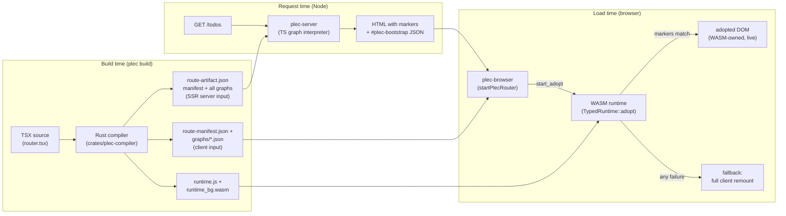
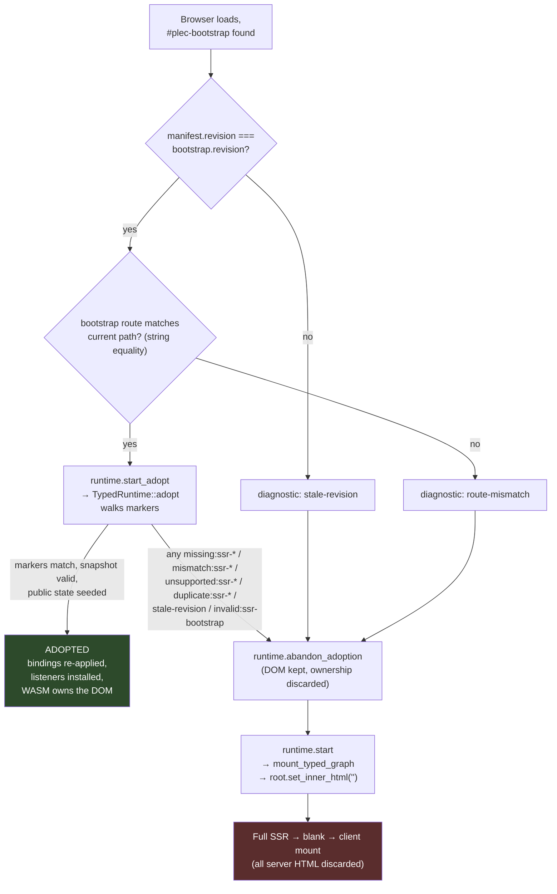

# SSR Architecture Audit

> Status snapshot as of August 2026. Reflects what is _implemented today_, not design targets.

## TL;DR

- SSR is **not a compiler feature**. The Rust compiler has zero SSR-specific code — it emits deterministic component graphs plus a route manifest, and SSR _emerges_ from three components agreeing on one contract.
- The server renderer is a **~255-line TypeScript interpreter** (`packages/plec-server`) that string-renders the same compiled graph the client runs. No WASM, no React, no VDOM on the server.
- Hydration is called **adoption**: the WASM runtime claims server-rendered DOM by matching path-qualified markers, then re-attaches bindings and listeners in place.
- Adoption follows a **strict contract** — one missing/mismatched marker or invalid snapshot fails the whole page, which then falls back to a destructive client-side remount (discarding all SSR HTML).
- Loops, conditionals, and loader routes **do adopt** today: the v2 bootstrap carries a typed execution snapshot (route chain, loader outcomes, branch selections, loop row keys) that the WASM runtime validates and uses to claim server-rendered rows/branches in place.

## High-level architecture

SSR works because one compiled artifact is consumed three ways — the compiler's only obligations are determinism and stable node indices:

Key property: **server renderer, browser glue, and WASM runtime all walk the exact same graph** — the marker grammar below is the only thing tying them together.

## Component roles

### `crates/plec-compiler` — produces the contract, knows nothing about SSR

- `lower_routes` (`crates/plec-compiler/src/routes.rs:46`) discovers `createRootRoute`/`createRoute` calls from static option objects; string-literal paths required.
- `lower_route_artifacts` (`routes.rs:197`) compiles every route phase (root / page / pending / error) into **self-contained graphs** and injects `RouteOutlet` records into parent graphs so children have a declared mount point.
- `stable_revision` (`routes.rs:420`) — FNV-1a hash over the serialized artifacts. This single value is the freshness handshake between server HTML and client runtime.
- Node vector indices are deterministic (`crates/plec-lowering/src/node.rs:12`); **the push index becomes the SSR marker coordinate**.
- `RouteManifest::validate` enforces version 3 (`crates/plec-ir/src/lib.rs:87`).
- `ExecutionOwner { Shared, Server, Client }` + `PublicExport` (`crates/plec-ir/src/lib.rs:11`): the server boundary is now enforced — snapshot `public.exports` re-validate through `validate_public_export` (client-owned, non-serializable, or non-explicit entries are rejected), and the SSR renderer gates server-only host loads at the render boundary. Source-level export designation is still future work; v1 snapshots ship `exports: {}` and the loader-transfer slice will be the first producer.

### `packages/plec-server` — the SSR renderer (pure TS, no WASM)

- `createPlecServer` (`packages/plec-server/src/index.ts:58`): one handler — `/api/*` goes to a host-supplied escape hatch; document requests take the SSR path; everything else is static assets.
- Reads and `JSON.parse`s the **entire artifact bundle on every request** — no caching (`index.ts:68`).
- `matchRoute` (`index.ts:165`): flat segment matching with `$param` and catch-all `*` support.
- `renderNode` (`index.ts:196`): recursive interpretation of the graph, including a small stack-VM `evaluate` (`index.ts:235`) for expressions. Host slots are request-aware for public state — `location` resolves from the URL. Cookie host slots are server-only: they evaluate as absent during SSR and each gated load is recorded for the development-only `x-plec-ssr-gating` response header (`index.ts:282`), so request cookies can never reach markup or the bootstrap.
- Any render throw → serve the static SPA shell instead; the `x-plec-ssr-fallback` header exposes the error **in development only** (`index.ts:77-86`).

### `packages/plec-browser` — the adoption gatekeeper

- `startPlecRouter` (`packages/plec-browser/src/index.ts:499`): reads `#plec-bootstrap`, fetches manifest + graphs, registers them, then decides adopt-vs-fallback (diagram below).
- Emits `plec:adoption` CustomEvent + `onAdoptionDiagnostic` callback with structured outcome/codes — this is how the acceptance test asserts behavior.
- Standalone (non-router) mounts **never adopt** (`index.ts:382`); adoption is router-only.

### `packages/plec-runtime` (WASM) — the adopter

- `start_adopt` (`runtime/lifecycle.rs:332`): version gate (v3 only) → manifest validation → `adopt_typed_route`.
- `adopt_typed_route` (`router/navigation.rs:24`): adopts the root graph at path `root`, then walks the matched route chain adopting each child into its outlet element.
- `TypedRuntime::adopt` (`typed/runtime.rs:841`): the actual claim walk (below).
- `abandon_adoption` (`lifecycle.rs:381`): discards runtime ownership but **intentionally leaves server DOM intact** so the destructive remount is the single, observable fallback.
- During SSR itself the WASM runtime is **not involved at all** — it only ever runs in the browser.

## The handshake contract

Two things ship in the HTML. The typed execution snapshot below carries route identity, public state, and structural ownership — **no private component state, no query data, no cookies**. The client re-evaluates deterministic consequences via `apply_static_bindings` (the single re-evaluation point).

> **Contract evolution:** the browser now consumes the typed execution snapshot (`PlecSsrSnapshot`, `SSR_SNAPSHOT_VERSION = 2`, frozen in `crates/plec-ir/src/lib.rs`) through the v2 bootstrap: `{ version: 2, snapshot }`. The snapshot is parsed and validated **in WASM before adoption** (`PlecRuntime::start_adopt_snapshot`) — version gate (`unsupported:ssr-snapshot-version`), revision gate (`stale-revision`), full fail-closed validation (`mismatch:ssr-snapshot:*`), and request-location identity (`mismatch:ssr-location`). Its public state (location components and explicit public exports) is seeded into the shared host inputs before adoption claims DOM, so state initializers and re-evaluated bindings evaluate from imported causes. `abandon_adoption` purges exactly the seeded keys so the fallback remount starts clean. A legacy v1 bootstrap still adopts without imported state; an unparseable bootstrap fails closed with `invalid:ssr-bootstrap`.
>
> **Snapshot v2 — nested component execution state.** Version 2 added `structure.nested`: branch and loop records for nested component instances, keyed by the component's marker path (`{instance path}/component:{i}`, row-scoped below loops) with the compiled component id as the graph reference. `TypedRuntime::adopt` hands each adopted component runtime its own record (extracted by marker path at queue time), so the server-selected branch and the claimed row identity/order are consumed from records at any nesting depth instead of being reconstructed from DOM shape. The DOM-shape inference fallback for unrecorded conditionals remains only as a legacy compatibility path, and every use is counted (`PlecRuntime::ssr_conditional_inferences`, surfaced as `conditionalInferences` on the adopted diagnostic): a complete v2 snapshot keeps the counter at zero. A nested loop without a record still fails closed with `missing:ssr-loop`, which is exactly the v1 behavior.

**Divergence policy.** Two failure classes have distinct outcomes. _Structural mismatch_ — invalid snapshots, unknown markers, unreferenced structures — fails adoption closed with a specific code on `plec:adoption`. _Binding-value divergence_ — a recomputed static value differing from the server-rendered text — is allowed: recompute-consequences semantics win, and the divergence is counted (`PlecRuntime::ssr_text_divergences`) and surfaced on the adopted diagnostic (`snapshotImported`, `textDivergences`) for development reporting. No per-binding diffing or reconciliation exists.

**1. The bootstrap script** — `<script id="plec-bootstrap" type="application/json">` containing the v2 snapshot payload (`plec-server/src/index.ts`, `bootstrapPayload`): route chain identity, public request location, explicit public exports, and structural ownership per graph instance.

**2. Ownership markers** — the path grammar is the contract; paths compose as `root → /outlet:{id} → /component:{i} → /node:{i}`. The **authoritative protocol definition** — grammar, uniqueness, ownership, the one-shot adoption lifecycle invariant, and the `data-runtime-node` retirement — lives in [dom-address-protocol.md](./dom-address-protocol.md); the table below summarizes the SSR emission and claim mechanics:

| Construct   | Marker emitted by server                                                                                | Claimed by runtime via                                                              |
| ----------- | ------------------------------------------------------------------------------------------------------- | ----------------------------------------------------------------------------------- |
| Element     | `data-plec-node="{path}/node:{i}"` attribute                                                            | `querySelector` + case-insensitive tag check                                        |
| Text        | `<!--plec:text:{path}:{i}-->` before the text, `<!---->` sentinel when the value is empty               | adjacency claim (see the text-marker adjacency contract in dom-address-protocol.md) |
| Slot        | `<!--plec:slot…-->` … `<!--plec:slot-end…-->`                                                           | comment pair lookup                                                                 |
| Component   | `<!--plec:component…-->` … `<!--plec:component-end…-->`                                                 | comment pair, child adopted recursively                                             |
| Conditional | chosen branch rendered between `<!--plec:conditional:{path}:{i}-->` … `-end` markers                    | comment pair + snapshot branch record                                               |
| Loop        | keyed rows between `<!--plec:loop:{path}-->` … `-end` markers, row roots stamped `data-runtime-row-key` | comment pairs + snapshot ordered key list                                           |

Slot children render under the _caller's_ path — the caller's own adopt pass claims them directly, which is why slot-child mounting is skipped under adoption (`typed/runtime.rs:480`).

## The adoption decision — the risky part

This is the process worth understanding, because every failure funnels into the same destructive fallback. The decision lives in `packages/plec-browser/src/index.ts:558` and fails **closed** (fallback) on every doubt:

The claim walk itself (`TypedRuntime::adopt`, `typed/runtime.rs:841`) is deliberately paranoid, per its own doc comment: _"an absent or stale marker is an adoption failure, never an excuse to silently attach a listener to a guessed node."_

- Indexes **every comment node** in the subtree into a map keyed by raw comment text (`runtime.rs:1030`).
- Per graph node: elements claimed by selector + tag equality; text claimed as the node immediately after its marker (an **empty text node is created** if SSR rendered an empty string); components queued and adopted recursively once their props are re-evaluated client-side.
- Finishes by re-executing every binding against client-evaluated state and queueing listeners — the DOM is _overwritten_, not diffed, so server/client value drift is self-healed and counted on the adopted diagnostic (`textDivergences`).

## Current limitations

- Dynamic constructs outside the typed snapshot's ownership vocabulary (arbitrary effects, refs, runtime component lookup) still fail closed with an `unsupported:ssr-*` / `missing:ssr-*` code — the demo's pages all adopt.
- No server-side data fetching beyond the compiled route-loader subset — no TanStack DB, no prefetch, no query execution. The only other "server data" is the `/api/*` escape hatch.

## Risk register

**Guaranteed-fallback traps**

- Any structural doubt — one missing/duplicated marker, a snapshot the WASM validator rejects, a phase/param disagreement between the transferred chain and the browser URL — fails the **whole page's** adoption, not just that subtree.
- A route whose server-rendered markup depends on state the snapshot cannot express (dynamic component lookup, unsupported host slots) still falls back.

**Route matchers that can disagree**

- Server `matchRoute` (flat, segment-count) and WASM `typed_route_chain` (hierarchical, static-preferring, cross-validated against the snapshot chain + URL) can still disagree on nested trees; the browser glue only shape-checks the published chain (`validateSsrRouteChain`), so disagreement surfaces as a WASM fail-closed code rather than opaque `missing:ssr-node:*`.

**Fragile assumptions in the claim walk**

- Comment map keyed by raw text — a duplicated `plec:component:root:3` comment anywhere in the subtree is rejected outright (`duplicate:ssr-marker:*`) rather than silently hijacking a claim (`runtime.rs:1030`).
- Text claiming assumes the text node is _immediately_ after its marker — any proxy/minifier/extension inserting whitespace between them breaks every downstream binding.
- Any HTML mutation (comment stripping, attribute rewriting) by middleware or browser extensions guarantees fallback.
- Nested component adoption uses scoped ownership indexes (`adoption_index_walks` is asserted in the wasm-bindgen suite) instead of re-walking the entire root subtree per component.

**Silent drift & observability**

- Post-adoption `apply_static_bindings` overwrites server values with client re-evaluation. Tag/markers are the only structural checks, but value divergence is no longer fully invisible: it is counted (`ssr_text_divergences`) and surfaced on the adopted diagnostic. Cookie differences specifically cannot diverge silently — cookies never render server-side (see the render-boundary gating above).
- Production SSR failures serve the SPA shell with **no log or metric**; the fallback header is dev-only.
- TS and Rust expression VMs must agree opcode-for-opcode; `binary` server-side supports only 6 operators (`plec-server/src/index.ts:253`) — an op supported in Rust but not TS renders wrong HTML that gets silently self-healed.

**Known sharp edges**

- Per-request `readFile` + `JSON.parse` of the whole artifact bundle — no caching (`plec-server/src/index.ts:68`).
- Event handlers (`on*` props) are dropped in SSR output — a page that fails adoption is inert until the remount completes.
- `.expect("adopted route exists")` panic path in the adopt chain (`router/navigation.rs:69`) — infallible in practice, but a WASM trap if state were inconsistent.
- `phases.dedup()` only removes _adjacent_ duplicates; the shipped artifact contains `FullstackLayout` twice (harmless today, latent confusion later).
- The adopt path has a dedicated wasm-bindgen contract suite: the SSR adoption/snapshot/conditional/loop/loader sections of `crates/plec-runtime/tests/typed_events.rs` cover the fail-closed codes, import seeding order, and divergence counting. Browser-side coverage is the Playwright suites `packages/plec-e2e/tests/acceptance/adoption.playwright.ts` (happy path) and `adoption-mismatch.playwright.ts` (mismatch matrix + divergence).

## Error code reference

All adoption failures are structured strings, surfaced as mismatch codes in `plec:adoption` diagnostics:

| Code family                  | Meaning                                                         | Example source                                                                                      |
| ---------------------------- | --------------------------------------------------------------- | --------------------------------------------------------------------------------------------------- |
| `missing:ssr-*`              | A marker/artifact the contract requires wasn't found            | node, text, slot, component, loop, branch, route-graph, manifest                                    |
| `mismatch:ssr-*`             | Found, but wrong (tag, manifest validation)                     | `mismatch:ssr-tag:{marker}`                                                                         |
| `unsupported:ssr-*`          | Construct the adoption slice deliberately doesn't handle        | snapshot version, manifest version, `unsupported:ssr-nested-loop` (loop inside a loop row template) |
| `duplicate:ssr-*`            | The ownership index saw the same marker/row key twice           | `duplicate:ssr-marker:{raw comment}`                                                                |
| `detached:ssr-text`          | Text marker present but detached from the document              | DOM mutated post-render                                                                             |
| `stale-revision`             | Browser-glue gate and WASM snapshot gate                        | revision skew                                                                                       |
| `mismatch:ssr-route-chain:*` | Browser-glue shape check; WASM cross-validation of chain vs URL | empty/unknown route/bad params/phase/length                                                         |
| `invalid:ssr-bootstrap`      | Present but unparseable bootstrap script                        | JSON parse failure                                                                                  |

## Key file map

| Area          | File                                                                 | Role                                              |
| ------------- | -------------------------------------------------------------------- | ------------------------------------------------- |
| Compiler      | `crates/plec-compiler/src/routes.rs`                                 | Route/artifact lowering, `stable_revision`        |
| Compiler      | `crates/plec-lowering/src/node.rs`                                   | Deterministic node indices (= marker coordinates) |
| Compiler      | `crates/plec-ir/src/lib.rs`                                          | Manifest schema + v3 validation                   |
| Server        | `packages/plec-server/src/index.ts`                                  | HTTP host + SSR graph interpreter                 |
| Browser       | `packages/plec-browser/src/index.ts`                                 | `startPlecRouter`, adoption gate, diagnostics     |
| Runtime       | `crates/plec-runtime/src/runtime/lifecycle.rs`                       | `start_adopt` / `abandon_adoption`                |
| Runtime       | `crates/plec-runtime/src/router/navigation.rs`                       | Route-chain adoption, outlet resolution           |
| Runtime       | `crates/plec-runtime/src/typed/runtime.rs`                           | `TypedRuntime::adopt` claim walk                  |
| E2E           | `packages/plec-e2e/tests/acceptance/adoption.playwright.ts`          | Happy-path adoption suites                        |
| E2E           | `packages/plec-e2e/tests/acceptance/adoption-mismatch.playwright.ts` | Mismatch matrix + divergence diagnostic           |
| Runtime tests | `crates/plec-runtime/tests/typed_events.rs`                          | wasm-bindgen adoption/snapshot contract suite     |
